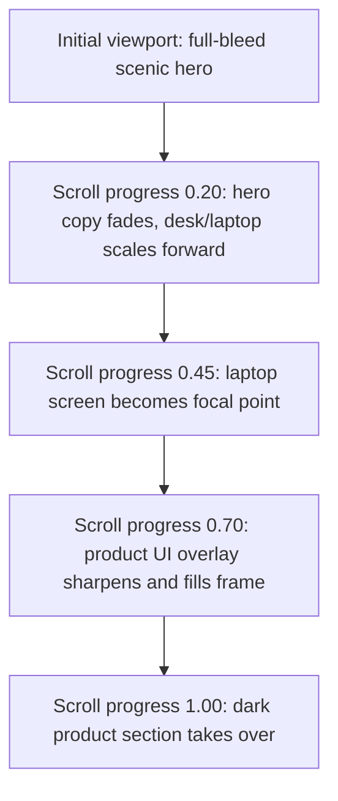

# feat: Build Cinematic Teacher Workspace Landing Page

## Overview

Create a greenfield TanStack Start React landing page for Teacher Workspace using shadcn/ui, Tailwind CSS, and Radix Colors. The core design effort is a Mercury-inspired cinematic first viewport: a full-bleed scenic hero that scrolls or plays through a staged zoom from a wide environment into a laptop/product interface, then hands off into a dark product-detail section.

The reference is Mercury's landing page animation style and the supplied screenshots. The implementation should borrow the interaction structure, pacing, and visual quality, not Mercury's exact brand, copy, assets, or banking UI.

## Problem Frame

The project needs to establish a premium landing page foundation and make the first impression feel unusually polished. The most important outcome is not a generic marketing page; it is a memorable motion-led hero that makes "Teacher Workspace" feel like a product with craft, credibility, and atmosphere.

## Requirements Trace

- R1. Use TanStack Start as the React framework.
- R2. Use shadcn/ui and Tailwind CSS for UI composition and styling.
- R3. Use Radix Colors as the source for color scales and theme variables.
- R4. Build a Mercury-like cinematic landing-page animation as the primary design investment.
- R5. Keep the page responsive across desktop and mobile.
- R6. Avoid copying Mercury assets, layout details, brand marks, product copy, or exact UI.
- R7. Verify the final result visually in a browser, including the animation states.

## Scope Boundaries

- This plan covers a single-page landing experience, not a full marketing site.
- No authentication, payment, CMS, analytics, or backend lead capture is required beyond a polished front-end email field or CTA stub.
- The Mercury screenshots are reference material only; production media should be original.
- The initial implementation should favor a high-quality hero plus one strong follow-up section over many shallow sections.

## Context & Research

### Relevant Code and Patterns

- The workspace is currently empty, so this is a greenfield project.
- TanStack Start uses file-based routes in `src/routes`, with `src/routes/__root.tsx` as the root route and `src/routes/index.tsx` for `/`.
- TanStack Start also uses `src/router.tsx` and generated `src/routeTree.gen.ts`.
- shadcn/ui supports a TanStack Start template via the CLI, so the project can start from `shadcn@latest init --template start` rather than hand-wiring all UI configuration.

### Institutional Learnings

- No `docs/solutions/` directory exists in this workspace, so there are no local project learnings to carry forward.

### External References

- shadcn/ui TanStack Start installation: `https://ui.shadcn.com/docs/installation/tanstack`
- TanStack Start quick start: `https://tanstack.com/start/latest/docs/framework/react/quick-start`
- TanStack Start routing guide: `https://tanstack.com/start/latest/docs/framework/react/guide/routing`
- Tailwind CSS with Vite: `https://tailwindcss.com/docs/installation/using-vite`
- Radix Colors installation and usage: `https://www.radix-ui.com/colors/docs/overview/installation`, `https://www.radix-ui.com/colors/docs/overview/usage`

## Key Technical Decisions

- Scaffold with the shadcn TanStack Start template: This best matches the requested stack and should produce the right Tailwind, import alias, and `components.json` baseline.
- Use `pnpm` by default: It is a good fit for shadcn/TanStack workflows and can be swapped if the user prefers another package manager.
- Use Radix Colors via CSS imports and Tailwind theme variables: Import only selected scales, then map them into semantic tokens used by shadcn components and custom landing-page CSS.
- Use `motion/react` for the hero sequence: The animation needs scroll progress, transforms, opacity interpolation, and reduced-motion handling. CSS alone is possible but would be less ergonomic for this staged cinematic sequence.
- Use original media assets: Generate or design a unique "teacher desk / product laptop" environment instead of using Mercury's imagery.
- Keep the first release mostly static: The email capture UI should look complete, but submission can be a no-op or client-side success state unless the user later asks for lead capture.

## Open Questions

### Resolved During Planning

- Should this modify an existing app? No. The workspace is empty, so this should be a new greenfield project.
- Should the Mercury screenshots be used directly? No. They are references for motion and composition only.
- Is shadcn compatible with TanStack Start? Yes. The current shadcn docs include TanStack Start setup paths.

### Deferred to Implementation

- Final product name and copy: Use "Teacher Workspace" as the product name.
- Final asset generation method: The implementer can use generated raster imagery, commissioned/static design assets, or a short generated video, as long as the animation stages remain original and performant.
- Final deployment target: Not needed for the first local landing page build.

## Visual Direction

**Visual thesis:** A quiet, cinematic teacher workspace at dawn: natural light, a desk or laptop in a landscape-like setting, then a confident transition into a dark product interface for lessons, attendance, grading, and parent communication.

**Content plan:** Header, cinematic hero with email CTA, scroll-linked zoom into product UI, dark product detail section, compact proof/feature strip, final CTA.

**Interaction plan:** Scroll-linked hero zoom, text and CTA fade as the camera approaches the laptop, product UI crossfade from in-scene laptop screen into a full dark interface panel.

## High-Level Technical Design

> *This illustrates the intended approach and is directional guidance for review, not implementation specification. The implementing agent should treat it as context, not code to reproduce.*

The page should use one sticky animation region with a height around `280vh` to `360vh`. A `CinematicHero` component owns scroll progress and passes derived values to subcomponents for the scenic background, foreground desk/laptop, copy group, email CTA, and product UI overlay.

## Implementation Units

- [x] **Unit 1: Project scaffold and tooling**

**Goal:** Create the TanStack Start app with shadcn/ui, Tailwind, TypeScript, linting, and basic scripts.

**Requirements:** R1, R2

**Dependencies:** None

**Files:**
- Create: `package.json`
- Create: `pnpm-lock.yaml`
- Create: `components.json`
- Create: `tsconfig.json`
- Create: `vite.config.ts`
- Create: `src/router.tsx`
- Create: `src/routes/__root.tsx`
- Create: `src/routes/index.tsx`
- Create: `src/routeTree.gen.ts` or let TanStack generate it
- Create: `src/styles/app.css`
- Test: `package.json` scripts for typecheck/build

**Approach:**
- Use the shadcn TanStack Start template as the baseline.
- Prefer `--base radix` if prompted so component primitives stay aligned with Radix conventions.
- Add only the shadcn components needed for this page: `button`, `input`, `navigation-menu` or simple custom nav, `separator`, `tooltip` if needed.
- Add `motion` for scroll-linked animation.

**Patterns to follow:**
- TanStack route files under `src/routes`.
- shadcn imports through the configured `@/` alias.
- shadcn semantic component tokens instead of raw utility colors for reusable UI.

**Test scenarios:**
- The app starts locally without route-generation errors.
- TypeScript compiles with strict settings.
- Production build succeeds.

**Verification:**
- The root route renders at `/`.
- Tailwind classes apply.
- shadcn components render with expected styling.

- [x] **Unit 2: Radix Colors and theme tokens**

**Goal:** Establish the color system before building UI so the landing page does not drift into ad hoc colors.

**Requirements:** R2, R3, R5

**Dependencies:** Unit 1

**Files:**
- Modify: `src/styles/app.css`
- Modify: `components.json`
- Create: `src/lib/theme.ts` if JavaScript color metadata is useful
- Test: visual browser verification

**Approach:**
- Install `@radix-ui/colors`.
- Import only the needed light and dark scales, likely `gray`, `slate` or `mauve`, `blue`, `cyan`, `amber`, and matching dark scales.
- Map Radix variables into Tailwind/shadcn semantic tokens such as `--background`, `--foreground`, `--primary`, `--muted`, `--border`, and landing-specific tokens such as `--scene-haze`, `--scene-shadow`, `--interface-surface`.
- Keep the palette balanced: cool dark interface surfaces, warm dawn highlights, and one blue/cyan action accent.

**Patterns to follow:**
- Radix Colors CSS variables such as `var(--blue-9)` and `var(--gray-12)`.
- Tailwind v4-style CSS-first theme tokens if the scaffold uses Tailwind v4.

**Test scenarios:**
- Light hero text remains readable over the image at all animation stages.
- Dark product section meets contrast expectations.
- CTA, focus rings, and input borders are consistent with Radix color scales.

**Verification:**
- No one-off hex-heavy palette appears in component files.
- Interactive controls have visible hover and focus states.

- [x] **Unit 3: Original visual asset pipeline**

**Goal:** Prepare original media for the cinematic hero and product transition.

**Requirements:** R4, R5, R6

**Dependencies:** Unit 2

**Files:**
- Create: `public/media/hero-wide.webp`
- Create: `public/media/hero-mid.webp`
- Create: `public/media/hero-laptop.webp`
- Create: `public/media/product-ui.webp` or build the product UI as HTML/CSS
- Create: `src/content/landing.ts`
- Test: browser screenshot verification at desktop and mobile sizes

**Approach:**
- Implemented with local visual placeholders that preserve the future media contract:
  - A poster/start placeholder layer with the calm workspace composition.
  - A scrub placeholder layer controlled by the same opacity hook a future video will use.
  - An end-frame placeholder layer controlled by the same opacity hook a future close frame will use.
  - Product UI frame as HTML overlay that becomes the next section.
- Later, replace the placeholders with original WebP/AVIF poster/end frames and MP4/WebM video sources while keeping the existing scroll timing model.
- Avoid embedding Mercury logos, finance copy, or exact interface shapes.

**Patterns to follow:**
- Store page copy separately in `src/content/landing.ts`.
- Keep heavy media in `public/media`.

**Test scenarios:**
- Assets load in production build paths.
- Mobile crop keeps the focal object visible.
- Image sizes do not create an unacceptable initial load.

**Verification:**
- Desktop hero has a strong first-frame composition.
- Mobile hero still communicates brand, CTA, and the animation focal point.

- [x] **Unit 4: Cinematic hero animation**

**Goal:** Build the Mercury-inspired scroll animation as the page's signature moment.

**Requirements:** R4, R5, R7

**Dependencies:** Units 1, 2, 3

**Files:**
- Create: `src/components/landing/cinematic-hero.tsx`
- Create: `src/components/landing/site-header.tsx`
- Create: `src/components/landing/email-capture.tsx`
- Modify: `src/routes/index.tsx`
- Modify: `src/styles/app.css`
- Test: `src/components/landing/cinematic-hero.test.tsx` if the test stack is added

**Approach:**
- Use a sticky hero region with layered absolute elements and motion values derived from scroll progress.
- Keep the nav fixed or sticky above the hero, shifting from translucent over-image styling to dark-section styling.
- Stage the animation:
  - `0.00-0.18`: brand, headline, and email capture sit over wide media.
  - `0.18-0.42`: copy fades while background/foreground layers scale and translate toward the laptop.
  - `0.42-0.68`: laptop/product screen becomes the focal point; peripheral image darkens/softens.
  - `0.68-1.00`: product UI overlay crossfades into the next dark product section.
- Implement `prefers-reduced-motion` support with static staged artwork and no scroll-linked transforms.

**Patterns to follow:**
- shadcn `Button` and `Input` for the email CTA.
- `motion/react` hooks for scroll progress.
- Semantic HTML: `header`, `nav`, `main`, `section`, `form`.

**Test scenarios:**
- Hero renders without browser-only errors during SSR/hydration.
- Reduced-motion mode shows a stable first viewport and still exposes the CTA.
- Animation states do not overlap text or controls at 1440px, 1024px, 768px, and 390px widths.
- Keyboard focus can reach nav links, input, and CTA.

**Verification:**
- Playwright screenshots capture early, middle, and late scroll states.
- The scene is nonblank and assets are visibly loaded.
- No text is clipped inside buttons, nav items, or the email field.

- [x] **Unit 5: Product detail and conversion sections**

**Goal:** Complete the landing page around the hero with concise product storytelling and a final CTA.

**Requirements:** R2, R3, R5

**Dependencies:** Unit 4

**Files:**
- Create: `src/components/landing/product-section.tsx`
- Create: `src/components/landing/proof-strip.tsx`
- Create: `src/components/landing/final-cta.tsx`
- Modify: `src/routes/index.tsx`
- Modify: `src/content/landing.ts`
- Test: browser screenshot verification

**Approach:**
- Build the dark product section as the destination of the hero transition.
- Use restrained sections, not a card-heavy SaaS grid.
- Suggested page structure:
  - Hero: "Teacher Workspace" with one promise and email CTA.
  - Product section: "One tab for the work around teaching."
  - Proof strip: three compact outcomes or capabilities.
  - Final CTA: email field or button repeated once.
- Keep the product UI visually dense enough to feel real, but avoid building a full app shell.

**Patterns to follow:**
- shadcn components only where they provide real controls or structure.
- Full-width bands instead of nested cards.

**Test scenarios:**
- Page remains readable when animation is skipped.
- CTA repetition does not create competing primary actions.
- Content order makes sense to screen readers.

**Verification:**
- The section after the hero is visible enough to hint that the page continues.
- Mobile layout has no horizontal overflow.

- [x] **Unit 6: Visual QA, performance, and accessibility pass**

**Goal:** Make the page feel production-grade and catch layout or motion failures before handoff.

**Requirements:** R5, R7

**Dependencies:** Units 1-5

**Files:**
- Create: `tests/landing.spec.ts` if Playwright is added
- Modify: affected components and CSS based on findings
- Create: `README.md`

**Approach:**
- Run typecheck and production build.
- Use browser screenshots at desktop and mobile sizes.
- Capture early, middle, and final hero scroll states.
- Check reduced-motion behavior.
- Audit asset weight and use image dimensions/aspect ratios to prevent layout shift.

**Patterns to follow:**
- Stable dimensions for fixed-format UI elements.
- Responsive constraints over viewport-scaled font sizes.

**Test scenarios:**
- Desktop first viewport matches the intended cinematic composition.
- Mobile first viewport is legible and CTA-accessible.
- Mid-scroll product focus state is framed correctly.
- Reduced-motion users receive a non-animated but coherent layout.

**Verification:**
- `pnpm build` succeeds.
- Screenshots show nonblank media and no overlapping UI.
- Lighthouse or manual checks show acceptable contrast, alt text where needed, and reachable focus states.

## System-Wide Impact

- **Interaction graph:** The landing page is self-contained under the root route and landing components. No backend integration is planned.
- **Error propagation:** Asset loading failures should degrade to solid-color backgrounds and visible text/CTA, not a blank hero.
- **State lifecycle risks:** The email form should avoid pretending to submit to a real backend unless one exists. Use local success state only if needed.
- **API surface parity:** No public API surface is introduced.
- **Integration coverage:** Browser screenshots and scroll-state checks are more important than unit tests for this visual feature.

## Risks & Dependencies

- The biggest risk is asset quality. The animation will only feel premium if the scene, laptop, and product UI share lighting, perspective, and color.
- Scroll-linked animation can become fragile on mobile. The mobile plan may need fewer stages and a shorter sticky region.
- TanStack Start and shadcn templates evolve quickly. Use the current CLI output as the source of truth during implementation.
- Large image or video assets can hurt first paint. Optimize aggressively and consider preloading only the first hero frame.

## Documentation / Operational Notes

- Add a short `README.md` with setup commands, scripts, and where landing content/assets live.
- Document the animation stages in the component comments only where the transform mapping is non-obvious.
- Keep the source screenshots out of the production app unless the user explicitly wants an internal reference folder.

## Sources & References

- shadcn/ui TanStack Start installation: https://ui.shadcn.com/docs/installation/tanstack
- TanStack Start quick start: https://tanstack.com/start/latest/docs/framework/react/quick-start
- TanStack Start routing guide: https://tanstack.com/start/latest/docs/framework/react/guide/routing
- Tailwind CSS Vite installation: https://tailwindcss.com/docs/installation/using-vite
- Radix Colors installation: https://www.radix-ui.com/colors/docs/overview/installation
- Radix Colors usage: https://www.radix-ui.com/colors/docs/overview/usage
