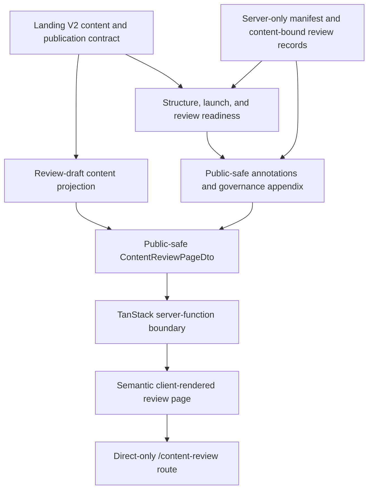

# feat: Add Teacher Workspace IA content review prototype

## Overview

Add a direct-only, neutral `/content-review` route that lets PM, policy,
security, and design reviewers inspect the proposed Teacher Workspace
information architecture and copy without changing the current `/` landing
page. The route will render one connected positive-growth story, public
capability labels, the static explorer outline, and publication context from
typed content rather than from the current themed choreography.

The review surface will keep its public-copy projection separate from
public-safe review annotations and the governance appendix. Raw content and
review metadata stay behind a server-only projection boundary; the browser
receives only the public-safe page DTO. The phase adds no persistent backend,
workflow service, authentication, analytics runtime, imagery, motion, product
simulation, or interaction design. A branch preview may later be shared for
review, but it is not access control and must not be promoted to production.

---

## Problem Frame

The current landing route is coupled to a paper-themed, scroll-driven product
story. The next IA, claims, and publication decisions are still draft, so
rendering them in that shell would make unsettled structure look final and
would encourage visual feedback before content clearance.

The origin requirements establish a different artifact: a semantic,
content-first review page whose hierarchy works without presentation, whose
story is positive and public-safe, and whose pending decisions are explicit
rather than replaced with plausible-looking copy (see origin:
`docs/brainstorms/2026-08-04-teacher-workspace-ia-content-review-requirements.md`).

---

## Requirements Trace

- R1. Keep the review prototype isolated from the current public landing page
  and production deployment.
- R2. Use a naturally flowing semantic document with neutral presentation and
  no reliance on media, motion, or themed components.
- R3. Give ordered sections and reviewable claims stable references that do not
  depend on visual position.
- R4. Cover promise, connected story, reveal, capabilities, explorer,
  audiences, proof, access/support, close, footer, and feedback.
- R5. Use one connected story about a teacher noticing and celebrating positive
  student growth.
- R6. Map the story in order to Student Insights, Next-step guidance, Message
  drafting, and Posts.
- R7. Keep the specific growth signal, final wording, and unsupported claims
  visibly proposed until cleared.
- R8. Use Teacher Workspace as the only public brand and keep internal names
  out of both content projections and the rendered review route.
- R9. Exclude bullying, discipline, crisis, and other negatively framed
  scenarios from this public-content phase.
- R10. Expose status, source, owner, required approval, and concerns for each
  reviewable section or claim.
- R11. Omit pending content from the review-draft public copy and represent its
  registry position as a decision-only review slot instead of rendering nulls
  or invented copy.
- R12. Summarise synthetic data, claims, proof, access, support, and measurement
  boundaries in one compact appendix.
- R13. Make formal approval revision-aware in principle: bind review evidence
  to the reviewed item revision and preserve unrelated item records when one
  item changes.
- R14. Render the accepted explorer as a static three-step outline only.
- R15. Make the Google sign-in contract reviewable without adding auth or
  conversion tracking.
- R16. Preserve semantic landmarks, logical headings, keyboard access, visible
  link focus, feedback access, and animation-independent content.

**Origin actors:** A1 (teachers and school staff), A2 (Designer and PM), A3
(policy and security reviewers), A4 (website implementers)

**Origin flows:** F1 (review the public story), F2 (understand the intended
public experience), F3 (hand the approved structure into visual design)

**Origin acceptance examples:** AE1 (unstyled source-order coherence), AE2
(unapproved claim treatment), AE3 (public naming and scenario safety), AE4
(governance appendix coverage), AE5 (static explorer and access contract), AE6
(branch isolation and accessibility)

### Trace to implementation and verification

| Origin intent | Units | Primary verification |
| --- | --- | --- |
| R3-R13; F1-F3; AE1-AE4 | U1, U2 | Manifest/projection completeness, positive-story contract, and review-state tests |
| R2-R16; F1-F3; AE1-AE6 | U3 | Semantic rendering, complete positive story, naming safety, public-safe output, static explorer, appendix, and accessibility tests |
| R1, R15, R16; F1, F3; AE5, AE6 | U4 | Full-router isolation and resolved document-head tests plus preview release gate |
| R1, R7, R10, R12, R13; F1, F3 | U5 | Documentation review and stable-reference handoff check |

Every canonical section and public claim must have exactly one review-manifest
entry. A completeness validator and rendered-page test enforce that R10 applies
to the whole artifact, not only the four capability claims.

---

## Scope Boundaries

- Do not modify the current `/` route, current v1 copy, choreography subtree,
  product mock, hero assets, or current landing components for this phase.
- Do not add a link to `/content-review` from public navigation. The route is
  direct-only and `noindex`; obscurity is not treated as authentication.
- Do not place confidential comments, student data, teacher identities,
  account identifiers, secrets, or restricted evidence on the review route.
- Treat the complete route as unauthenticated and publicly retrievable. Review
  annotations must be public-safe display data and must exclude free-form
  comments, personal identifiers, raw approval history, restricted evidence,
  internal IDs, and internal capability names from the rendered DOM and
  serialised route output.
- Do not statically import raw Landing V2 content or review records into a
  route or client-rendered component. A direct-only URL and DOM assertions do
  not protect material that has already entered a public JavaScript bundle.
- Do not add a themed visual system, new Shadcn components, decorative assets,
  animation, bespoke responsive choreography, or interaction design.
- Do not implement scenario state, tabs, product simulation, analytics events,
  authentication, AI inference, persistence, APIs, or backend processing.
- Do not invent final story copy, audience answers, testimonials, schools,
  support destinations, launch metadata, evidence, or approvals.
- Do not deploy or promote this branch to the production Vercel environment.
- Do not merge the review route into the production branch while it exists in
  this form; leaving `/` unchanged does not make a new public route safe to
  ship.

### Deferred to Follow-Up Work

- Visual system, media, responsive art direction, and motion: begin only after
  the IA and content direction are sufficiently reviewed.
- Interactive three-step explorer: implement after its scenario, screens, and
  synthetic artifacts are approved.
- Analytics and cross-domain attribution: implement only after correlation,
  consent, retention, event delivery, and product/auth ownership are approved.
- Public route replacement and production rollout: plan separately after all
  publication gates clear.
- Publication projection and approval automation: add only after the canonical
  decision channel, responsible steward, evidence contract, and protected
  change controls are defined. This review artifact must not act as a CMS or
  publication authority.

---

## Context & Research

### Relevant Code and Patterns

- `src/routes/index.tsx` composes the current public page from
  `ScrollChoreography`; keeping this file unchanged is the primary isolation
  guard.
- `src/routes/__root.tsx` already owns the global skip link, SGDS masthead, and
  document shell that the direct-only route can inherit.
- `src/content/landing-v2.ts` is the typed source for confirmed naming, ordered
  capabilities, access, audience intent, explorer contract, proof,
  publication, and measurement boundaries. Its proposed financial-assistance
  journey is replaceable and is not approved acceptance criteria.
- `src/content/landing-v2-readiness.ts` already separates structural errors
  from unresolved launch decisions and distinguishes owners from recorded
  approvers.
- `src/content/landing-v2.test.ts` demonstrates exhaustive contract fixtures,
  public-copy checks, and explicit launch-decision assertions.
- `src/components/landing/landmark-audit.test.tsx` demonstrates role-based
  landmark testing, while `src/routes/-index.head.test.tsx` demonstrates
  route-head contract testing.
- `src/config/site.ts` remains the only source for product, feedback, support,
  and issue links.
- `src/routeTree.gen.ts` is generated by the existing route tooling and must
  never be edited manually.

### Institutional Learnings

- No `docs/solutions/` directory or project-specific institutional learning
  document exists. The Landing V2 foundation and its tests are the local
  source of truth.

### External References

- TanStack Start code is isomorphic by default, so ordinary route imports can
  enter both the server and client bundles. Route loaders also execute during
  client navigation; they are not a server-only boundary.
- Use a TanStack `createServerFn` RPC boundary for page-data assembly and keep
  raw imports in a `.server.ts` module. The route loader may call the server
  function, but route components consume only the serialisable public-safe
  DTO and type-only client-safe definitions.
- Verify the resulting public bundle, serialised loader response, and rendered
  HTML. Source-level separation alone is not proof that raw review material is
  absent from the browser surface.
- No generic guidance is used to invent policy, security, approval, or
  measurement rules. Those unresolved decisions remain explicit gates.

---

## Alternative Approaches Considered

| Approach | Review quality | Rework risk | Decision |
| --- | --- | --- | --- |
| Reuse the current themed landing shell | Low: visually anchors unapproved IA and copy | High: content remains coupled to choreography | Rejected |
| Build a polished greyscale Shadcn wireframe | Medium: quieter, but still invites component and spacing feedback | Medium: layout decisions arrive before clearance | Rejected |
| Add a semantic direct-only review route | High: reviewers see structure, copy, and governance directly | Low: presentation can be replaced independently | Chosen |

---

## Key Technical Decisions

- **Use `/content-review`, not a branch-only replacement of `/`:** this keeps
  the current landing route and its tests intact, makes comparisons possible,
  and reduces accidental production blast radius.
- **Update the V2 draft story at its source:** replace the non-canonical
  financial-assistance journey in `src/content/landing-v2.ts` with a generic,
  clearly proposed positive-growth arc instead of layering contradictory copy
  in the renderer.
- **Make the five-act mapping explicit:** act 1 is the positive-growth setup
  and maps to no capability. Acts 2-5 map exactly once and in order to Student
  Insights, Next-step guidance, Message drafting, and Posts.
- **Keep one governance authority:** `src/content/landing-v2.ts` remains the
  source for existing status, source, owner, and publication decisions. The
  review manifest adds only stable references, order, concern classification,
  content binding, unresolved required roles, and decisions for the exact
  reviewed content. It derives existing facts rather than copying them and
  stores no comments, timestamps, or approval-history system.
- **Bind review records to content, not a manual counter:** a deterministic
  snapshot key identifies the exact reviewed public fields. Copy changes
  therefore surface a reconfirmation warning even if an editor forgets to
  update a revision label. IA order has its own snapshot so reordering stales
  only the order review, not section-copy reviews.
- **Build only the review-draft projection:** the page may render explicitly
  authored proposed copy through a `reviewDraftProjection`. A publication
  projection has no consumer in this phase and is deliberately deferred;
  stripping annotations must never imply that draft copy is publishable.
- **Keep review records informational:** repository data can display what was
  reviewed against which snapshot, but cannot establish formal approval while
  the canonical decision channel, evidence owner, and protected merge rules
  are undefined. The entire route remains non-publishable regardless of its
  displayed item states.
- **Enforce a server/client data boundary:** only server-side projection code
  may import raw Landing V2 content and review metadata. A TanStack server
  function returns a narrow `ContentReviewPageDto`; client-rendered modules
  import only its public-safe types and values.
- **Fail closed on unknown approval requirements:** an unresolved reviewer or
  evidence requirement is a blocking decision, never an empty list that can be
  treated as vacuously approved. Seed only the reviewer contracts already
  confirmed in the Landing V2 foundation.
- **Authorise displayed links explicitly:** HTTPS alone does not make a source
  or evidence public-safe. Each navigable review link needs a public-display
  classification; otherwise the route renders a non-linked source label.
- **Allow ordinary links only:** source, feedback, and CTA links may use native
  link behavior with visible focus, but receive no tracking, auth handling,
  simulated state, or custom interaction.
- **Treat preview safety as an operational gate:** add `noindex` metadata and a
  visible internal-review warning, while documenting that these are not access
  controls and do not authorize production promotion.

---

## Open Questions

### Resolved During Planning

- **How should the prototype be isolated?** Add an unlinked, direct-only
  `/content-review` route and leave `/` unchanged.
- **How should revision-aware review work without a CMS?** Each static review
  record cites a deterministic snapshot of the reviewed public content. A
  changed item becomes reconfirmation-required without invalidating unrelated
  items, and IA order is reviewed as a separate artifact. These records are
  informational until an authoritative approval channel is defined.
- **Should the CTA be interactive?** It may be an ordinary external link so its
  label, destination, access note, and keyboard behavior are reviewable. It has
  no analytics or auth implementation in this repository.
- **How should unapproved copy render?** Authored working copy may render beside
  an explicit proposed status. Missing content is omitted from the public
  review-draft copy and listed as a decision-only slot at its intended registry
  position; it is never backfilled with a placeholder sentence.

### Deferred to Content Clearance

- Final positive-growth signal, wording, and evidence.
- Required reviewers and evidence for each public claim.
- Canonical approval/decision channel, accountable review steward, acceptable
  evidence reference, and repository change-control rules. Until defined,
  unresolved mappings remain decision-required and no route state authorises
  publication.
- GA audience confirmation, audience questions and answers, testimonial
  permissions and missing capability coverage, support destination, canonical
  URL, indexing policy for production, social image, and final launch copy.
- Correlation, consent, retention, event delivery, and product/auth integration
  decisions for future measurement work.

---

## High-Level Technical Design

> *This illustrates the intended approach and is directional guidance for
> review, not implementation specification. The implementing agent should
> treat it as context, not code to reproduce.*

The review-draft projection may include explicitly authored proposed copy, but
it never receives missing-value placeholders or review metadata. The
public-safe page DTO composes that copy with adjacent annotations and
decision-only slots without serialising the raw manifest. Removing annotations
does not create a publishable artifact. The appendix summarises cross-cutting
publication boundaries from the existing contracts.

---

## Implementation Units

- U1. **Replace the draft journey and encode the ordered review structure**

**Goal:** Establish the positive-growth narrative and a stable IA/review
contract without duplicating the confirmed Landing V2 foundation.

**Requirements:** R3, R4, R5, R6, R7, R8, R9, R10, R11; F1, F2; AE1, AE2,
AE3

**Dependencies:** None

**Files:**
- Create: `src/content/landing-v2-review.types.ts`
- Create: `src/content/landing-v2-review.server.ts`
- Create: `src/content/landing-v2-review.server.test.ts`
- Modify: `src/content/landing-v2.ts`
- Modify: `src/content/landing-v2.test.ts`

**Approach:**
- Replace the existing proposed financial-assistance material across SEO,
  hero, journey, reveal, capability scenarios, close, and claim-readiness copy
  with a connected, synthetic positive-growth arc. Act 1 establishes that a
  teacher wants to build on emerging growth and maps to no capability. Acts
  2-5 then map exactly once and in order: Student Insights makes the positive
  signal visible, Next-step guidance supports a constructive response, Message
  drafting prepares a warm family message for teacher review, and Posts shares
  or records the celebration.
- Keep the exact signal and all new wording marked proposed. Do not reuse the
  real-looking name or attached example asset from the original issue.
- Add an ordered registry for promise, journey, reveal, capabilities,
  explorer, audiences, proof, access/support, close, and footer/feedback. Give
  every section a stable semantic review reference independent of array index.
- Make that typed public-copy registry the exhaustive source of narrative
  fields the review renderer may receive, with each field classified as copy,
  claim, destination, or omission. The review manifest augments this inventory
  rather than defining it; completeness fails when a new registry field has no
  review mapping.
- Keep `landing-v2-review.server.ts` as a server-only thin manifest keyed
  one-to-one by internal `contentId`. Derive existing source, owner, status,
  and publication facts from `landing-v2.ts`; add only order, public
  `reviewReference`, concern categories, content binding, unresolved required
  roles, public-link display classification, and current-content review
  records. `contentId` is never rendered or serialised; `reviewReference` is
  the only identifier reviewers cite.
- Keep `landing-v2-review.types.ts` client-safe: it contains only DTO types and
  public enums, no raw content, manifest values, internal identifiers, review
  evidence, or server imports.
- Cover every canonical section and public claim, not only the four capability
  claims, and add an independently reviewed IA-order artifact.
- Distinguish source provenance from claim evidence and mark each display link
  as public-safe or label-only. Keep the superseded bursary comment as
  historical context only and exclude it and its attached material from every
  rendered projection.
- Build a server-side `reviewDraftProjection` by internal content ID. It may
  include authored proposed copy, but must omit pending or intentionally
  omitted fields and all review-only metadata. The page DTO separately inserts
  a public-safe decision-only slot at the registry position of omitted content
  so reviewers retain an anchor without receiving fabricated public copy.
- Render every concern category through the page DTO as public-safe display
  text; a category must not disappear merely because its free-form detail is
  restricted.
- Add v2 footer content to the typed projection using the confirmed Teacher
  Workspace brand, copyright, and feedback destination without importing the
  v1 footer presentation.
- Require the accepted exact three-step explorer for this artifact; a
  `not-pursued` explorer is a contract failure rather than a renderable variant.
- Keep Teacher Workspace as the sole public brand and retain the existing
  internal IDs only for stable mapping.

**Execution note:** Start with failing contract tests for the positive
narrative, ordered registry, unique public references, server-only raw-data
boundary, and safe review-draft projection.

**Patterns to follow:**
- Typed `as const` contracts and stable ID arrays in `src/content/landing-v2.ts`
- Public-copy scanning and candidate fixtures in `src/content/landing-v2.test.ts`

**Test scenarios:**
- Happy path: the section registry covers every required IA section exactly
  once and projects them in the declared order.
- Happy path: act 1 maps to no capability and acts 2-5 map exactly once and in
  order to the four public capabilities while remaining marked proposed.
- Happy path: reordering a section changes order but preserves its stable review
  reference and item-copy review record while changing the independently
  reviewed IA-order snapshot.
- Happy path: every canonical section and claim has exactly one manifest entry
  with derived status/source/owner facts plus concern and approval-requirement
  state.
- Edge case: duplicate section or claim references are rejected as structural
  errors.
- Edge case: pending, blank, or omitted fields do not become `null`, `undefined`,
  empty headings, or invented placeholder prose in public copy; each intended
  position still has a decision-only review slot with a stable public
  reference.
- Error path: content projection fails its contract if an internal brand or a
  specifically excluded sensitive-story term is introduced.
- Error path: a missing, duplicate, or mismatched stable content reference
  returns no projection plus explicit issues; it never partially renders stale
  plausible copy.
- Error path: an accepted explorer changed to `not-pursued` is rejected for the
  review artifact.
- Regression: the old financial-assistance wording, comment/asset link, and
  real-looking example identity are absent from the draft projection,
  public-safe display annotations, and serialisable page DTO.
- Regression: v2 footer projection contains the brand, copyright, and feedback
  semantics without importing v1 content or themed components.

**Verification:**
- Reviewers can reference every section and core claim without visual-position
  language.
- Reading only the projected content communicates a coherent positive-growth
  journey across the four capabilities.

---

- U2. **Add revision-aware informational review readiness**

**Goal:** Make proposed, partially reviewed, current, stale, and blocked review
states truthful without presenting repository records as formal approval or
adding a database/workflow system.

**Requirements:** R7, R10, R11, R12, R13; F1, F3; AE2, AE4

**Dependencies:** U1

**Files:**
- Create: `src/content/landing-v2-review-state.server.ts`
- Create: `src/content/landing-v2-review-state.server.test.ts`
- Modify: `src/content/landing-v2-readiness.ts`
- Modify: `src/content/landing-v2.test.ts`

**Approach:**
- Evaluate each review item independently from its stable content reference and
  deterministic snapshot of the reviewed fields.
- Define the canonical item-snapshot payload as the item's visible heading,
  public copy fields, public claim text, capability mapping, and authorised
  link label/destination, serialised in a declared field order. Exclude owner,
  status, required reviewers, evidence, review reference, concern details,
  formatting, and presentation. Normalise Unicode, line endings, and outer
  whitespace before a versioned SHA-256 digest. Define the IA-order snapshot
  separately as the ordered internal content IDs so presentation changes do
  not invalidate content reviews.
- Define a composed-story snapshot over the ordered public-copy projection in
  addition to item and IA-order snapshots. An item edit keeps unrelated item
  records current but makes the composed story reconfirmation-required, so an
  unchanged sentence cannot retain contextual clearance after the promise,
  reveal, or surrounding order changes its meaning.
- Derive exactly one display state using this precedence: (1) `blocked` for a
  structural or public-safety failure; (2) `decision-required` for an explicit
  blocker or unknown owner/reviewer/evidence requirement; (3)
  `reconfirmation-required` when a recorded review references a different
  snapshot; (4) `unreviewed` when no current-snapshot review exists; (5)
  `partially-reviewed` when only some confirmed required roles have a current
  record; and (6) `reviewed-current` when all confirmed roles have a
  current-snapshot record. This status is informational and never implies
  publication approval.
- Owner assignment remains distinct from review. An unknown required-reviewer
  mapping fails closed as `decision-required`, never an empty list that can be
  treated as complete.
- Do not seed a current review record merely from an owner name, a meeting note,
  or the existence of working copy. Until a canonical external channel and
  evidence reference are defined, affected items remain `decision-required`
  or `unreviewed`.
- Support only the confirmed flat reviewer-role sets in the existing
  foundation. Do not infer conditional reviewers, expiry, delegation,
  evidence-dependent approval, or bundle-level policy. If clearance later
  requires those rules, keep the affected item decision-required and extend
  the model in the publication phase.
- Represent a stale decision for review without exposing raw decision history
  on the unauthenticated route, and classify the current item as
  reconfirmation-required.
- Keep item-level invalidation local: changing one claim or artifact must not
  invalidate unrelated item records. Use the composed-story snapshot to flag
  contextual changes across the whole narrative.
- Add review-structure errors and publication-affecting review decisions to the
  existing readiness summary without weakening current launch checks. Do not
  add an aggregate `publishable` result in this phase.
- Bind IA order to a separate snapshot: reordering stales the IA-order and
  composed-story reviews, while section and claim item records remain current.
- Keep evidence optional when no decision is recorded. HTTPS is necessary but
  insufficient for display; a separate public-display classification controls
  whether an evidence/source URL becomes a link.

**Execution note:** Implement the review-state transitions test-first because
incorrect review carry-over is the highest-risk logic in this phase.

**Patterns to follow:**
- Pure validation functions and `error` versus `decision` severity in
  `src/content/landing-v2-readiness.ts`
- Ready and not-ready fixtures in `src/content/landing-v2.test.ts`

**Test scenarios:**
- Happy path: every confirmed required reviewer role has a record for the
  current content snapshot and only that item becomes `reviewed-current`.
- Edge case: one of several required roles is missing, so the item remains
  `partially-reviewed` and the page does not imply clearance.
- Edge case: reviewer requirements are unknown or unresolved, so the item is
  decision-required and cannot be treated as reviewed by an empty list.
- Edge case: previously reviewed copy changes without an editor manually
  changing a revision label; the content snapshot changes, making the prior
  record stale and the item reconfirmation-required.
- Edge case: a section is reordered without copy changes; the IA-order and
  composed-story reviews become stale while section and claim item records
  remain current.
- Edge case: revising one claim leaves current records for unrelated claims
  intact.
- Edge case: editing the promise leaves an unchanged capability's item record
  current but makes the composed story require reconfirmation.
- Error path: a review record names the wrong item or a nonmatching content
  snapshot and is ineffective while producing a review issue.
- Error path: duplicate review references or a review record with no matching
  section/claim is reported as a structural error.
- Integration: the combined readiness summary continues to report every
  existing launch blocker plus distinct structure, review, and publication
  decisions.
- Integration: no review-state result reports publishability; the review-draft
  projection and route-level warning always preserve the non-publishable phase
  boundary.

**Verification:**
- No owner, partial review, or stale review can clear a review gate.
- The review page can consume one deterministic readiness result without
  reimplementing status logic.

---

- U3. **Render the neutral semantic review page**

**Goal:** Present the draft public story and internal review context as a
readable, accessible, content-only artifact.

**Requirements:** R2-R16; F1, F2, F3; AE1-AE6

**Dependencies:** U1, U2

**Files:**
- Create: `src/components/content-review/content-review-page.tsx`
- Create: `src/components/content-review/content-review-outline.tsx`
- Create: `src/components/content-review/content-review-appendix.tsx`
- Create: `src/components/content-review/content-review-error.tsx`
- Create: `src/components/content-review/content-review-page.test.tsx`

**Approach:**
- Render a single-column document with one H1 and logical, unskipped headings.
  Use native sections, lists, links, asides, and description lists; do not add a
  themed component layer.
- Keep the content outline in its own component and feed it only the
  serialised public-safe page DTO. Compose public-safe review notes as adjacent
  semantic annotations, never as CSS-hidden content inside the public-copy
  projection. Client-rendered components must not import `landing-v2.ts`, any
  `.server.ts` module, raw manifest data, or review records.
- Constrain all narrative/public copy to the exhaustive typed registry feeding
  the projection. The renderer may add only a small enumerated allowlist of
  fixed review-interface labels. A new claim-bearing copy field cannot render
  until it has a registry entry and corresponding manifest coverage; test this
  with an intentionally unmapped field fixture.
- Identify statuses with visible text, not colour alone. Show stable reference,
  owner, required reviewer roles, revision state, source/evidence display, and
  blockers
  without rendering free-form comments, personal identifiers, raw approval
  history, restricted evidence, internal IDs, or internal names.
- Add a compact status key that explains both meaning and next action:
  `blocked` stops review; `decision-required` needs a named decision;
  `reconfirmation-required` needs review of the current snapshot; `unreviewed`
  awaits review; `partially-reviewed` names the remaining confirmed roles; and
  `reviewed-current` means reviewed against this snapshot but not approved for
  publication.
- At each intended registry position with omitted public copy, render a
  decision-only annotation carrying its public review reference, status,
  owner, required role, and concern category. Do not invent a public heading or
  paragraph for the missing content.
- Render the explorer as the accepted three ordered steps with no buttons,
  tabs, selectable scenarios, product UI, or state.
- Render the two intended CTA placements as ordinary links using the confirmed
  label, destination, and account note. Add no click handler, analytics import,
  OAuth behavior, or tooltip-only access information. State visibly that the
  link opens the live Teacher Workspace product and apply no-referrer behavior
  to CTA, feedback, source, and evidence links.
- Add a compact appendix covering synthetic/prohibited data, claims,
  testimonial provenance and permission, access, support, and provider-neutral
  measurement ownership.
- Include a neutral footer with the existing feedback link; do not reuse the
  themed current header, footer, button, imagery, motion, or choreography
  components.
- For unapproved testimonials, render only aggregate blocker, stable review
  reference, capability-coverage gap, and permission status. Do not render the
  quote, role, school attribution, or source link until each displayed field is
  separately cleared for the unauthenticated route.
- Default every source/evidence reference to a non-linked label. It becomes a
  link only when a named authority has recorded a current, provenance-backed
  public-display decision for that exact destination. Because that authority
  is not yet defined, the initial artifact exposes no source/evidence links;
  public product and feedback destinations from `src/config/site.ts` remain
  ordinary links under their existing contract.
- If content/reference validation fails, render a conspicuous review error and
  no plausible public story rather than crashing or partially rendering stale
  content. The safe error view shows only `CONTENT_REVIEW_INVALID`, the build
  snapshot, a direction to stop review, and the existing feedback link; it
  never serialises raw diagnostics.

**Execution note:** Begin with an accessibility-oriented rendering test for the
unstyled reading order and absence of interaction-dependent content.

**Patterns to follow:**
- Role-based Testing Library assertions in
  `src/components/landing/landmark-audit.test.tsx`
- Existing skip-link target and footer-outside-main landmark relationship
- URLs from `src/config/site.ts`, never duplicated literals

**Test scenarios:**
- Covers AE1. Happy path: with presentation ignored, headings and content appear
  in registry order and tell the complete positive-growth story.
- Covers AE2. Happy path: proposed content has a text status and associated
  review context, while pending content is represented only as a decision
  required.
- Covers AE4. Happy path: the appendix exposes synthetic-only and prohibited
  data, product-claim approval, testimonial provenance/permission and missing
  coverage, the exact access contract, support blockers, proxy-versus-true
  conversion ownership, unresolved correlation/consent/retention/delivery,
  and payload allow/deny fields.
- Covers AE5. Happy path: the explorer is an ordered three-step outline and has
  no button, tab, combobox, dialog, or scenario state.
- Covers AE5. Integration: both CTA placements use the same confirmed label,
  destination, and access note without tracking or auth behavior.
- Covers AE6. Accessibility: the composition has one `main#main`, one H1,
  unskipped heading levels, visible-text statuses, semantically associated
  annotations, and a contentinfo landmark outside main.
- Edge case: a pending audience answer, support destination, or testimonial is
  absent from public copy but still appears at its registry position as an
  explicit review decision with a stable public reference.
- Error path: no image, video, canvas, motion region, or product-mock content is
  rendered inside the review page's `main`; the inherited institutional SGDS
  shell is outside this assertion.
- Error path: the full serialised route output, including annotation markup,
  ARIA text, and data attributes, contains no internal IDs/names, unapproved
  quotes, personal identifiers, raw approvals, restricted evidence, or hidden
  review JSON.
- Error path: an invalid manifest/reference result shows the review error,
  renders no draft story or raw diagnostics, offers the feedback exit, and
  clearly instructs reviewers to stop rather than continue against stale data.
- Keyboard: CTA, source, and feedback links use native navigation and receive a
  visible focus treatment without requiring pointer interaction; every
  external link suppresses referrer data.

**Verification:**
- The page remains understandable in source order, at narrow widths, and with
  CSS disabled.
- Review annotations can later be removed from composition without editing the
  public-content outline.

---

- U4. **Expose a direct-only noindex review route**

**Goal:** Make the review artifact locally and preview-addressable while
leaving the current landing page and production path unchanged.

**Requirements:** R1, R15, R16; F1, F3; AE5, AE6

**Dependencies:** U3

**Files:**
- Create: `src/server/content-review.ts`
- Create: `src/routes/content-review.tsx`
- Create: `src/routes/-content-review.head.test.tsx`
- Create: `src/routes/content-review.test.tsx`
- Create: `scripts/verify-content-review-public-output.mjs`
- Modify: `package.json`
- Generated: `src/routeTree.gen.ts`
- Confirm unchanged: `src/routes/index.tsx`

**Approach:**
- Add `/content-review` as an unlinked route inheriting the existing root skip
  link and SGDS masthead.
- Define a TanStack `createServerFn` in `src/server/content-review.ts`. Its
  handler imports the raw projection builder from
  `landing-v2-review.server.ts` only on the server and returns the narrow
  `ContentReviewPageDto`. The route loader calls that RPC; neither the route
  component nor its transitive client imports may read raw Landing V2 or review
  modules directly.
- Give the route plain draft metadata and explicit `noindex, nofollow` robots
  policy. Do not emit a canonical link, social preview image, or hero-image
  preload while those publication decisions are unresolved.
- Display a persistent text notice that this is an internal content-review
  artifact, not approved public content and not access-controlled. Include the
  review content snapshot so reviewers can distinguish a current preview from
  a stale one without adding build-time identity or analytics.
- Let the existing route tooling regenerate `src/routeTree.gen.ts`; do not hand
  edit generated output. Route generation occurs through the existing
  Vite/TanStack build path; inspect the generated match and type surface after
  generation.
- Preserve `/` and all current landing imports exactly so branch work cannot
  silently replace the public composition.
- Add a post-build verification command that scans `.output/public` JavaScript,
  HTML, JSON, and any generated source maps for a server-only denylist covering
  internal names/IDs, superseded story text/URLs, unapproved testimonial
  fragments, restricted-evidence fixtures, and raw review-record fields. Pair
  it with a route-response assertion; DOM-only tests are insufficient because
  unused or loader-only data can still ship in client assets.
- Treat branch preview creation as an explicit release gate: verify the target
  is a non-production project/alias and record preview URL, owner, reviewed
  snapshot, and expiry in a preview inventory. Never promote it. Retirement
  requires deleting the superseded deployment/alias, verifying the URL no
  longer serves the artifact, and updating the inventory. If future review
  material cannot be public-safe, do not deploy this unauthenticated route;
  use an approved protected channel instead.

**Patterns to follow:**
- File-based route definition in `src/routes/index.tsx`
- Head-shape contract testing in `src/routes/-index.head.test.tsx`

**Test scenarios:**
- Happy path: `/content-review` resolves to the semantic review page and retains
  the global skip-link target.
- Happy path: route metadata contains `noindex, nofollow` and neutral draft
  title/description.
- Edge case: route metadata omits canonical, social image, and all image
  preloads while those decisions are pending.
- Regression: a full router render of `/` still contains the existing landing
  body and public metadata/preload, never inherits review robots directives,
  and exposes no `/content-review` link.
- Integration: a full router render of `/content-review` resolves the route,
  root shell, skip-link target, review page, and resolved document metadata with
  exactly one title/description and the required robots directive.
- Security regression: the server function returns only the DTO allowlist, and
  the built public assets, loader response, and rendered HTML contain none of
  the server-only denylist values or raw record fields.
- Integration: the generated route tree matches `/content-review` after normal
  Vite/TanStack generation and passes type-level verification; the test does
  not attempt to prove how the generated file was edited.
- Manual release gate: the implementation diff leaves `src/routes/__root.tsx`,
  `src/routes/index.tsx`, `src/content/landing.ts`, current landing components,
  choreography, and hero assets unchanged; `src/routeTree.gen.ts` is the only
  expected shared routing output.
- Manual preview gate, only if deployment is later authorised: project and
  alias are non-production; inventory fields are complete; the prior preview
  has been retired and verified unavailable; and an owner accepts the expiry.

**Verification:**
- Reviewers can open the direct route in a branch preview, while the same
  preview's `/` remains the existing landing page.
- Search-engine directives and visible copy both communicate that the artifact
  is not public-ready; no claim of access control is made.

---

- U5. **Document the content-review workflow and visual handoff**

**Goal:** Make the review route usable by other teams and preserve its
operational boundaries for the later visual phase.

**Requirements:** R1, R7, R10, R12, R13; F1, F3

**Dependencies:** U1, U2, U3, U4

**Files:**
- Modify: `README.md`
- Modify: `docs/landing-page-v2-foundations.md`

**Approach:**
- Record the positive-growth narrative decision and the financial-assistance
  story's non-canonical status.
- Document the direct review URL, stable-reference feedback convention,
  blocked/decision-required/reconfirmation-required/unreviewed/
  partially-reviewed/reviewed-current meanings, their required next actions,
  and how item, IA-order, and composed-story snapshots trigger
  reconfirmation.
- List the review owners and unresolved content-clearance gates without
  presenting owner assignment or repository data as approval. The Designer
  temporarily facilitates and collates feedback, Xingyu validates product
  content, and policy/security decisions remain externally recorded until a
  canonical channel and steward are explicitly named.
- Document the handoff rule: restricted evidence stays in the approved
  external channel and is referenced there by public review reference plus
  snapshot. The unauthenticated route never carries it.
- State that branch previews are not access control, must contain only
  public-safe material, must identify their reviewed snapshot, must be retired
  and verified unavailable when superseded, and must never be merged or
  promoted to production from this phase. Specify the preview inventory fields
  (URL, project/alias, owner, snapshot, created date, expiry, retirement
  verification).
- Define the visual handoff: the reviewed draft projection and stable order are
  inputs, not publication authority; public-safe annotations and neutral
  presentation are removable; publication projection, media, interactions,
  analytics, and production routing remain follow-up work.
- Run one short review pilot before visual handoff with the Designer, Xingyu,
  and an available policy or security reviewer. Success means they can cite
  stable references, distinguish every state and next action, identify omitted
  content without mistaking it for copy, and focus feedback on IA/content
  rather than visual styling. The Designer owns the positive/opportunity-led
  story rubric; PM and policy/security reviewers decide their respective
  claims in the approved external channel.

**Patterns to follow:**
- Decision-versus-implementation boundary in
  `docs/landing-page-v2-foundations.md`
- Concise project-shape guidance in `README.md`

**Test scenarios:**
- Test expectation: none -- this unit changes documentation and operational
  guidance only; behavior is covered in U1-U4.

**Verification:**
- A PM, policy, or security reviewer can use the route and cite a stable review
  reference without reading source code.
- Pilot participants can identify the correct status/action and leave feedback
  against a stable reference plus current snapshot without needing a visual
  walkthrough.
- A future visual implementer can identify exactly which content, order, and
  gates must survive the reskin.

---

## System-Wide Impact

- **Interaction graph:** A server function reads the existing V2 content plus
  server-only review model/readiness output and returns a public-safe DTO. The
  client route does not call the product, auth, analytics, or persistent
  backend surfaces.
- **Error propagation:** Invalid section mappings, duplicate references,
  missing content, partial reviews, and stale reviews become explicit
  structural or decision issues rendered in review context; they never fall
  through as plausible public copy.
- **State lifecycle risks:** Review state is static, informational repository
  data rather than authenticated approval. Records bind to deterministic item,
  IA-order, and composed-story snapshots; unknown reviewer requirements fail
  closed. U2 tests stale/partial records and local versus contextual
  invalidation.
- **API surface parity:** No API, environment variable, database, auth, or
  product surface changes. The provider-neutral event contract remains
  descriptive only.
- **Integration coverage:** Page tests cover the review-draft/annotation
  boundary; full-router tests cover resolved preview metadata, server-function
  serialization, and root isolation; a post-build scan covers public assets;
  the existing suite protects the unchanged landing experience.
- **Unchanged invariants:** Existing capability order, public naming, Google
  access contract, audience intent, testimonial provenance rules, footer
  feedback destination, and marketing/product-auth boundary remain intact.

---

## Success Metrics

- The manifest has 100% one-to-one coverage of canonical sections and public
  claims, with zero duplicate or orphaned stable references.
- The review-draft projection preserves exactly five journey acts, four ordered
  capabilities, three audiences, three explorer steps, and two CTA placements;
  act 1 maps to no capability and acts 2-5 map one-to-one in the accepted order.
- The review-draft public copy contains zero pending/omitted fields, review
  metadata, internal IDs/names, restricted links, or unapproved testimonial
  fields; every omission still has a decision-only review slot.
- Copy changes accept zero stale item reviews; order or contextual copy changes
  make the IA-order or composed-story review require reconfirmation without
  erasing unrelated item records.
- The serialised DTO, loader response, rendered HTML, and built public assets
  contain zero confidential fields, raw review history, internal capability
  names/IDs, real-looking student data, restricted source material, or
  superseded financial-assistance material.
- A manual content rubric confirms the story is positive and opportunity-led;
  the Designer facilitates it, while keyword checks protect known exclusions
  but do not substitute for human policy review.
- A PM/policy/security pilot reviewer can cite stable references, interpret
  statuses and next actions correctly, and identify omissions without mistaking
  the neutral page for visual direction or publication approval.
- The current `/` route remains behaviorally and structurally unchanged, and a
  release gate prevents merge or production promotion of the review route.
- The later visual phase can reuse the reviewed draft and stable order while
  dropping review annotations and neutral presentation; it must introduce its
  own publication projection and gates.

---

## Risks & Dependencies

| Risk | Mitigation |
| --- | --- |
| Reviewers mistake the preview for approved public content | Persistent text warning, `noindex`, explicit statuses, no production promotion |
| Direct-only route is mistaken for access control | Store only public-safe material and document that the URL is not private |
| Raw review/source data enters the client bundle | Assemble DTO behind a TanStack server function and scan public assets, loader output, and HTML |
| An HTTPS source exposes restricted material | Default to label-only; require a current authority/provenance-backed display decision before linking |
| Unapproved testimonial text is effectively published as an annotation | Show aggregate permission/coverage blockers only until each field is cleared |
| Positive-growth copy overclaims unverified behavior | Keep wording proposed, identify claims individually, and require external review against the exact content snapshot |
| Review metadata drifts from the content it describes | Typed stable references, referential validators, and projections from shared data |
| A static record is mistaken for authenticated approval | Label all states informational, define the external decision channel before publication work, and prohibit publication from this phase |
| An old review survives edited wording or context | Bind item, IA-order, and composed-story reviews to deterministic snapshots |
| The manifest certifies its own incomplete copy inventory | Render narrative copy only through an exhaustive typed registry and fail an intentionally unmapped-field test |
| Internal annotations leak into the eventual public page | Separate data projection and renderer; never rely on CSS hiding |
| Neutral layout becomes an accidental visual baseline | Label it as a review artifact and document the presentation as disposable |
| New route destabilises the current landing page | Leave `/`, v1 content, assets, and choreography untouched; retain existing tests |

---

## Documentation / Operational Notes

- No persistent backend or foundational service is required for this phase.
  One server-side data-projection boundary inside the existing TanStack app is
  required to keep raw review material out of public browser assets; the
  artifact still has no submission, persistence, or workflow endpoint.
- A Vercel branch preview may be created only as a review artifact after
  implementation verification and explicit user direction. Verify the exact
  project, alias, and environment are non-production before deployment; never
  promote the preview, record it in the preview inventory, retire and verify
  stale preview URLs unavailable, and do not merge the route to the production
  branch in this phase.
- Content clearance can proceed in parallel by citing stable review references
  and content snapshots in the approved external channel. Typed repository
  records remain display aids until that channel, its steward, and protected
  change controls are defined.
- The requirements document remains the source for product intent; this plan
  owns technical shape and sequencing only.

---

## Sources & References

- **Origin document:**
  `docs/brainstorms/2026-08-04-teacher-workspace-ia-content-review-requirements.md`
- Landing V2 foundation: `docs/landing-page-v2-foundations.md`
- Current landing route: `src/routes/index.tsx`
- V2 content contract: `src/content/landing-v2.ts`
- V2 readiness: `src/content/landing-v2-readiness.ts`
- Existing contract tests: `src/content/landing-v2.test.ts`
- Shared destinations: `src/config/site.ts`
- TanStack Start execution model:
  https://tanstack.com/start/latest/docs/framework/react/guide/execution-model
- TanStack Start server functions:
  https://tanstack.com/start/latest/docs/framework/react/guide/server-functions
- TanStack Start routing and route head:
  https://tanstack.com/start/latest/docs/framework/react/guide/routing
- TanStack Start code-execution patterns:
  https://tanstack.com/start/latest/docs/framework/react/guide/code-execution-patterns
