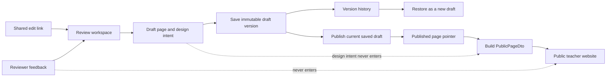

# Build a link-shared CMS for the replacement website

## Destination

Build the replacement website beside the released homepage. Keep `/` unchanged
until the replacement passes its content, data, and visual checks.

The replacement starts from the teacher-facing preview inside
`/content-review`. Review controls remain outside the teacher-facing page.
When the replacement is ready, its published version replaces the current
visual homepage at `/`.

Editors use a shared edit link. They can manage pages and sections from a fixed
library, save draft versions, restore history, comment, and publish. Teachers
see only published content.

## Why this needs a new plan

The completed prototype plan deliberately excluded persistence, APIs,
authentication, and CMS behaviour. It also required `/` to remain unchanged.
Those choices were correct for a review prototype.

This plan keeps the public-route safety boundary until cutover. It replaces the
prototype's storage and editing boundaries with a real content system.

This plan also amends two binding design records:

- `docs/decisions/2026-08-05-pm-facing-content-review-wireframe.md` prohibited
  route-local interaction and persistence. The reviewed page now needs both.
- `docs/decisions/2026-08-11-teacher-preview-review-annotations.md` kept edits
  and comments in memory. This plan makes them durable without mixing reviewer
  text into the teacher preview.

The existing separation between teacher content and reviewer tools remains
binding.

## Decisions made with the owner

| Decision | Chosen direction | Consequence |
| --- | --- | --- |
| Public release | Keep the current `/` until final cutover | CMS work cannot change the released homepage early |
| First CMS content | Use the teacher-facing page inside `/content-review` | Reviewer chrome never becomes public content |
| Save | Create one immutable, unpublished version | Saving never changes the public site |
| Publish | Publish the current saved draft through a separate action | Unsaved browser state cannot go live |
| Publishing rights | Any person holding the edit link may publish | No approval gate exists in this release |
| Access | Use a shared link with no account or OAuth flow | Names are self-declared and security is limited |
| Editor name | Ask for a display name before the first save | History shows attribution, not verified identity |
| Content management | Support page and section CRUD | Editors can create, duplicate, reorder, archive, and restore |
| Layout freedom | Use a fixed library of tested section types | A no-code layout builder is out of scope |
| Finish editing | Offer Save and finish, Discard changes, or Keep editing | The system never guesses whether to save |
| Version creation | Create versions only on explicit Save | No autosave or noisy history |
| Undo | Undo unsaved work with Cmd/Ctrl+Z and visible controls | Saved work is restored through version history |
| Restore | Copy an older version into a new draft version | History remains append-only |
| Concurrent edits | Reject stale saves and preserve local work | No silent overwrite or live co-editing |
| Reviewer material | Store design intent and feedback outside public content | Teachers never see design intent or comments |

## Terms used in the product

- **Page content:** text and approved assets teachers may see.
- **Design intent:** the curated reason a section exists and sits in its
  position.
- **Feedback:** a reviewer's comment on page content or design intent.
- **Draft version:** a saved version that is not public.
- **Published version:** the exact saved version shown on the public website.
- **Version history:** the list of saved versions and publication events.
- **Archive:** remove a page or section from use without deleting its history.
- **Edit link:** the shared URL that grants review and editing access.

Use these labels in the interface:

- **Show section context** / **Hide section context**
- **Why this section is here**
- **Design intent**
- **What to check**
- **Decision needed**
- **Your feedback**
- **Add feedback**
- **Edit content**
- **Save draft**
- **Finish editing**
- **Discard changes**
- **Version history**
- **Restore this version**
- **Publish**

Do not use **Revert changes**. It could mean undoing one edit, discarding the
session, or restoring a saved version.

## Scope

### Included

- Multiple pages with a unique title and public path.
- Page creation from an approved template.
- Page duplication, rename, path change, archive, and restore.
- Section creation from a fixed library.
- Section duplication, editing, reordering, hiding, archive, and restore.
- Stable IDs for pages, sections, fields, images, and review targets.
- Direct editing of teacher-facing copy.
- Structured fields for section design intent.
- Reviewer feedback tied to a stable target.
- Explicit draft saves and immutable version history.
- Local undo and redo for unsaved content changes.
- Full-session discard to the last saved baseline.
- Restore of an older saved version as a new draft.
- Separate draft and published pointers for each page.
- Shared-link access with a self-declared display name.
- Public paths limited to `/` and one path segment in this release.
- Stale-save detection with local work preserved.
- A reversible switch from the current `/` to the CMS-published homepage.

### Out of scope

- A free-form page builder.
- Custom HTML, MDX, CSS, or JavaScript entered through the CMS.
- New section layouts without code.
- OAuth, user accounts, verified identity, roles, or approval gates.
- Real-time cursors, live co-editing, or automatic merging.
- Autosave.
- Media upload or an asset library.
- Scheduled publishing.
- Localisation.
- Nested comment threads or notifications.
- Permanent deletion from the interface.
- A two-way sync with the current MDX and GitHub feedback path.

## Product flows

### Review the page

The teacher-facing page uses the full width by default. **Show section
context** opens the existing side panel. A numbered marker opens the matching
design intent and feedback.

Hiding the panel restores the full page width. Draft feedback stays available
until it is added or discarded.

### Edit content

Cmd/Ctrl+K or **Edit content** starts editing. The section context panel closes so
the editor can see the page at full width.

The toolbar shows:

- **Undo** and **Redo**
- **Save draft**
- **Finish editing**
- **Version history**
- **Publish**

Section controls allow add, duplicate, move, hide, and archive. Page settings
allow title, path, and search-description changes.

Section settings also hold **Design intent**, **What to check**, and
**Decision needed**. These fields never become directly editable teacher copy.

### Finish editing

If no unsaved changes exist, **Finish editing** returns to viewing.

If unsaved changes exist, show three choices:

- **Save and finish** creates one version, then exits editing.
- **Discard changes** returns to the last loaded or saved baseline.
- **Keep editing** closes the choice and keeps all work.

Closing or reloading the browser with unsaved work shows the browser's standard
leave-page warning.

### Save a draft

**Save draft** validates the whole page and creates one immutable snapshot.
The editor remains in edit mode. The new version becomes the session baseline.

Undo history resets after a successful save. To recover an earlier saved
state, use **Version history**.

If saving fails, keep every local change and explain what to do next.

Use: **We could not save this draft. Your changes are still here. Try again.**

### Resolve a concurrent edit

Each edit session starts from one saved version. Every save names that base
version.

If another person saves first, reject the stale save. Keep the second person's
complete local document. Show the latest saved version beside their changes.
Do not merge or overwrite automatically.

Use: **A newer version was saved. Your changes are still here. Compare them
before saving again.**

### View and restore history

Version history shows the version number, date, self-declared editor name, and
status. Status badges are **Current draft**, **Published**, and **Earlier**.
Restored versions show separate provenance, such as **Restored from version 4**.

An editor can preview any version. **Restore this version** copies its page
content and design intent into a new draft. It never changes the public site
or deletes later history. Existing comments and their statuses stay unchanged.
Targets missing from the restored version become archived, not deleted.

### Publish

Publish accepts only the current saved draft. Unsaved changes must be saved or
discarded first.

The confirmation names the page, version, public path, and editor. A successful
publish moves the published pointer in one database transaction. It then clears
the public cache for that path.

If publishing fails before the transaction commits, keep both pointers
unchanged. Use: **We could not publish this version. The public page has not
changed. Try again.**

Return distinct outcomes for published, published with delayed cache refresh,
stale request, and failure before commit. Never report a committed publication
as failed merely because cache clearing failed.

### Manage pages

New pages start from an approved template and remain unpublished. A public URL
resolves only after the page is published.

Archiving a published page requires a separate unpublish decision. The homepage
cannot be archived while it is the site's public root.

## Content model

The CMS stores structured documents, not rendered HTML.

```ts
type PageDocument = {
  page: {
    title: string
    path: string
    description: string
  }
  sections: SectionDocument[]
}

type SectionDocument = {
  id: string
  type: ApprovedSectionType
  state: 'visible' | 'hidden' | 'archived'
  fields: ApprovedFieldsForType
}

type ReviewDocument = {
  targets: Record<string, {
    designIntent: string
    checks: string[]
    decisionNeeded?: string
  }>
}
```

Each version row names its page schema, review schema, and section-library
version. Its canonical digest covers those values plus both documents.

`PageDocument` and `ReviewDocument` remain separate top-level values. A
whitelist-only `PublicPageDto` projector accepts `PageDocument` and removes
stable IDs, archived or hidden sections, schema details, and operational data.
Public routes can consume only `PublicPageDto`.

Each section type has a server-side schema. The schema defines required fields,
allowed URLs, repeat limits, and order rules. The client never decides these
rules alone.

Field names are stable keys in that schema. Repeated items and images carry
their own immutable IDs. A `cms_review_targets` row binds one target ID to its
page, section, field key, repeated-item ID, parent target, kind, and archive
state. The table owns identity and lifecycle. `ReviewDocument` owns versioned
design intent keyed by those target IDs.

Hiding changes presentation and keeps the section active. Archiving removes a
section from active use while keeping its content, target IDs, design intent,
and feedback. Restoring reactivates those same IDs.

### Stable identity rules

- A text edit, rename, move, or reorder keeps the same target ID.
- Archiving keeps the ID and its review history.
- Restoring reuses the archived ID.
- Duplicating creates new IDs.
- Duplicating never copies feedback.
- A true replacement creates a new ID.
- Labels, paths, filenames, array positions, and byte offsets are never IDs.

These rules replace the current `file#byte-offset` edit identity.

## Persistence model

Use PostgreSQL and Drizzle. This follows the FAQ site's proven full-document
snapshot model while separating Save from Publish.

| Record | Purpose |
| --- | --- |
| `cms_pages` | Stable page identity, archive state, and exact draft and published heads |
| `cms_page_versions` | Immutable page and review documents, version number, hashes, parent, restore source, editor name, and time |
| `cms_routes` | Unique normalised paths reserved by draft or published versions |
| `cms_publication_events` | Append-only, idempotent record of each published pointer change |
| `cms_review_targets` | Stable targets for pages, sections, fields, and screen annotations |
| `cms_comments` | Feedback subject, body, target, target version, display name, status, and timestamps |

Each version stores:

- `page_id`
- `version_number`
- `parent_version_id`
- `restored_from_version_id`, when present
- `page_schema_version`
- `review_schema_version`
- `section_library_version`
- `page_document`
- `review_document`
- `canonical_digest`
- `editor_display_name`
- `created_at`
- `attempt_id`
- `request_fingerprint`

The `attempt_id` makes a retried request safe. A lost response cannot create a
duplicate version.

Each head is the exact tuple `{versionId, versionNumber, digest}`. A composite
foreign key prevents a head from pointing at a version from another page. The
database rejects updates and deletes on version rows.

A save transaction locks the draft head, compares the expected tuple, inserts
one version whose parent is the locked head, then moves the draft head. A
publish transaction uses the same pattern for both expected heads.

The versioned page document is the authority for its path. `cms_routes`
reserves the normalised path before a draft save commits and resolves public
requests through the published version. Cross-page collisions fail the save or
publish without moving a head.

Paths may be `/` or one lower-case segment in this release. Publishing a changed
path makes the previous path return 404. Redirect management is out of scope.

Publication events carry their own `attempt_id` and request fingerprint. The
fingerprint binds the operation, target version, expected heads, path, and
display name. A cache-purge failure returns **Published, but cache refresh
failed**. It never reports that the database publication rolled back.

### Comment lifecycle

Comments are live review records. Restoring page content does not remove them.

- A comment records whether it concerns **Page content** or **Design intent**.
- It also records the version the reviewer saw.
- Changed content shows: **The page content changed after this feedback was left.**
- Changed context shows: **The design intent changed after this feedback was left.**
- An archived target shows: **This content was removed. Your feedback is kept.**
- Comments use **Open**, **Resolved**, or **Withdrawn**.
- Any person holding the edit link may update these states in this release.
- Hard deletion is unavailable.

## Shared-link access

This release has no account sign-in. It uses capability authentication through
one unguessable edit link.

The first valid visit exchanges the key for a secure, HTTP-only cookie and
removes the key from the visible URL. Store only the key hash and a separate
cookie-signing secret in the deployment environment.

The cookie is signed, `Secure`, `HttpOnly`, `SameSite=Strict`, and expires after
a fixed period. Every draft, history, design-intent, comment, comparison, and
write operation checks it. Mutation operations also check the request origin
and a CSRF token.

Anyone holding the edit link can act as an editor and publisher. Display names
are labels only. They are not proof of identity.

Rotating the edit key and cookie secret invalidates old links and sessions.
Tests must prove that an invalid, expired, or rotated capability cannot reach
CMS data or actions.

Cmd/Ctrl+K reveals editing controls only after the server accepts the shared
key. The shortcut never grants access by itself.

## Server operations

Implement narrow, validated server operations:

- `listPages()`
- `createPage(templateId, title, path, displayName)`
- `duplicatePage(sourcePageId, title, path, displayName)`
- `loadDraft(pageId)`
- `loadPublishedPage(path)`
- `saveVersion(pageId, expectedHead, documents, displayName, attemptId)`
- `listVersions(pageId, cursor)`
- `getVersion(pageId, versionId)`
- `restoreVersion(pageId, sourceVersionId, expectedHead, displayName, attemptId)`
- `publishVersion(pageId, versionId, expectedDraft, expectedPublished, displayName, attemptId)`
- `unpublishPage(pageId, expectedPublished, displayName, attemptId)`
- `archivePage(pageId, expectedLifecycle, displayName, attemptId)`
- `restoreArchivedPage(pageId, expectedLifecycle, displayName, attemptId)`
- `listComments(pageId, targetId, cursor)`
- `createComment(subject, targetId, targetVersionId, body, displayName)`
- `updateComment(commentId, expectedUpdatedAt, body)`
- `setCommentStatus(commentId, expectedUpdatedAt, status)`

All page saves are full-document transactions. Section CRUD does not make
separate database calls before **Save draft**.

Creating or duplicating a page is an explicit save. The transaction creates the
page, version 1, its draft head, route reservation, and lifecycle event. It does
not create a published head.

Page archive, restore, unpublish, and initial import create append-only
lifecycle or publication events. Each operation checks the expected state and
is idempotent. The initial import creates version 1, both valid heads, and one
system-attributed publication event in a single transaction.

## Editor state model

| Current state | Action | Result |
| --- | --- | --- |
| Viewing | Edit content | Editing, unchanged |
| Editing, unchanged | Change content or structure | Editing, unsaved changes |
| Editing, unchanged | Finish editing | Viewing |
| Editing, unchanged | Publish | Publishing, then editing unchanged |
| Editing, unsaved | Save draft | Saving with intent to keep editing |
| Editing, unsaved | Finish editing | Finish choice |
| Finish choice | Save and finish | Saving with intent to finish |
| Finish choice | Discard changes | Viewing at the session baseline |
| Finish choice | Keep editing | Editing, unsaved changes |
| Saving to keep editing | Success | Editing at a new saved baseline |
| Saving to finish | Success | Viewing at a new saved baseline |
| Saving | Failure | Editing with all local work kept |
| Saving | Stale base | Conflict with all local work kept |
| Viewing | Restore this version | New draft version, then viewing |
| Viewing | Publish | Published pointer changes on success |

Cmd/Ctrl+Z and redo operate on the unsaved operation stack. Comment fields and
the display-name field keep their normal text undo behaviour.

Version history may open while content is unsaved, but restore stays disabled.
Publish also stays disabled. Both actions explain: **Save or discard your
changes first.**

## Public and review data boundary



The public loader selects the published pointer, validates the stored digest,
and builds `PublicPageDto` through a whitelist projector. It must never
serialise drafts, design intent, comments, editor names, version history, edit
keys, stable IDs, hidden sections, or schema metadata.

Recursive prohibited-key tests enforce that boundary in source, SSR HTML, and
hydration data.

## Implementation path

### Phase 1: Freeze the replacement document

Define the first approved page template and section library. Export the exact
teacher-facing content now rendered inside `/content-review`.

Refactor the teacher preview to receive one structured document. Keep the
current MDX projection as its temporary source. Do not change `/`.

This slice must not change `src/routes/index.tsx`, `src/routes/__root.tsx`,
`src/content/landing.ts`, or current public landing components.

**Exit gate:** the refactored preview matches the current teacher preview at
320, 768, and 1280 pixels. The full build and postbuild leakage checks pass.
Public `/` remains unchanged.

### Phase 2: Add the database foundation

Add Drizzle, migrations, validated server-only environment access, and a
PostgreSQL repository. Run integration tests against a real PostgreSQL database.

Add an idempotent import command. Import the replacement document as version 1.
Create its draft head, published head, route record, and system-attributed
publication event in the same transaction.

**Exit gate:** a clean database can migrate, import, and return the same
normalised document twice without creating duplicates. Database constraints
enforce unique `(page_id, version_number)`, unique `(page_id, attempt_id)`,
unique normalised routes, immutable version rows, and same-page head pointers.

### Phase 3: Protect CMS access and prove the Vercel read path

Implement the edit-link exchange, signed cookie, expiry, rotation, origin
checks, and CSRF checks. Protect every draft and review operation before it can
be reached from a deployment.

Deploy one protected, read-only comparison route to Vercel. Prove the chosen
database driver under cold starts. Confirm the Nitro output, pooled or HTTP
connection, preview database isolation, and migration process.

Migrations run once through deployment operations. They never run during a
request, build, or cold start.

**Exit gate:** missing, invalid, expired, and rotated capabilities cannot load
the comparison route or CMS data. The deployed route reads the seeded preview
database reliably without touching `/`.

### Phase 4: Prove versions before editing UI

Implement load, save, history, restore, and publish transactions. Require
exact expected head tuples and idempotency keys. Recompute and check the stored
digest before projecting a document.

Keep publishing disconnected from `/`. The public homepage still reads its
released static source.

**Exit gate:** repository tests prove immutable saves, safe retries, stale-write
rejection, restore-as-new, publication idempotency, and separate draft and
published heads.

### Phase 5: Replace DOM mutation with an editor model

Move editing into a reducer built from an immutable session baseline. Support
text changes, section CRUD, page settings, undo, redo, and discard.

Add the visible **Save draft**, **Finish editing**, and **Version history**
controls. Keep local work after every network failure or stale-save response.

**Exit gate:** component tests cover each editor state and every finish choice.

### Phase 6: Make section context and feedback durable

Replace byte-offset anchors with stable target IDs. Store design intent in the
review document and feedback in `cms_comments`.

Preserve the current full-width preview and optional side panel. Keep all
reviewer prose outside the public page projection.

**Exit gate:** comments stay attached after edits, reorder, archive, save, and
restore. Public-output tests find no review data.

### Phase 7: Complete bounded page and section CRUD

Add the page list, create-from-template, duplicate, rename, path editing,
archive, and restore. Add every approved section type and its server-side
rules.

New pages remain unpublished. Reserved application paths cannot be used as page
paths.

**Exit gate:** each supported CRUD action survives save, reload, history, and
restore. Invalid documents fail without moving either page pointer.

### Phase 8: Add publishing in shadow mode

Connect **Publish** to the CMS published pointer. Keep `/` on its current static
source. Render the CMS-published homepage on a private comparison route.

Keep that route and every CMS-backed dynamic route behind the edit-link
capability. No new page becomes public during shadow mode.

Compare its public DTO, metadata, assets, responsive layout, and accessibility
against the approved replacement preview.

**Exit gate:** publishing changes the comparison route only. Draft content and
review data never appear in public HTML or hydration data.

### Phase 9: Cut over with a rollback switch

Add an explicit `CONTENT_SOURCE=static|cms` switch. Change production to `cms`
only after final approval.

The same cutover enables CMS-backed public paths. Draft, history, section
context, feedback, and mutation routes remain capability-protected.

Do not silently fall back to static content after a database error. Return a
clear service error so stale content is not mistaken for the current page.

Before cutover, export the published CMS version and back up the database.
Record the exact Vercel promotion and rollback commands, expected recovery
time, and schema compatibility with the rollback build. Test the runbook in a
preview environment.

Keep the static source available for an intentional rollback during the first
release window. A configuration change that needs a deployment is not treated
as an instant switch.

**Exit gate:** `/` serves the exact published CMS version. Changing a draft does
not change `/`. A tested configuration rollback restores the released static
homepage.

### Phase 10: Retire the prototype write path

After the cutover is stable, freeze the old MDX/GitHub submission path. Keep an
export of the final static source and the imported version.

Do not run two-way synchronisation between GitHub files and PostgreSQL.

## File map

Expected new areas:

- `src/cms/document.ts`
- `src/cms/review-document.ts`
- `src/cms/section-registry.ts`
- `src/cms/validation.ts`
- `src/db/schema.ts`
- `src/db/client.server.ts`
- `src/db/content-repository.server.ts`
- `src/server/cms-pages.ts`
- `src/server/cms-versions.ts`
- `src/server/cms-comments.ts`
- `src/server/cms-share-link.ts`
- `src/components/content-review/editor/`
- `src/components/content-review/version-history/`
- `src/routes/content-review/pages/`
- `src/routes/content-review/pages/$pageId.tsx`
- `src/routes/$slug.tsx`, after multi-page publishing is enabled
- `drizzle.config.ts`
- `migrations/`
- `.env.example`

Expected changes:

- `src/components/content-review/content-review-outline.tsx`
- `src/components/content-review/public-review-mode.tsx`
- `src/routes/content-review.tsx`
- `src/routes/index.tsx`, only during the cutover phase
- `src/routes/__root.tsx`, to separate public and editor layout concerns
- `.github/workflows/ci.yml`
- `package.json`

Generated route files remain generated.

## Acceptance tests

### Public safety

- `/` keeps rendering the released static page before cutover.
- Draft saves, restores, archives, and comments never change public content.
- The public loader reads one named published version.
- `PublicPageDto` strips stable IDs, hidden sections, design intent, comments,
  edit keys, editor names, drafts, and version metadata.
- Recursive prohibited-key checks cover the DTO, SSR HTML, and hydration data.
- A database failure never leaks a draft or partly rendered document.
- Missing or invalid edit-link capability cannot load drafts, comparison pages,
  history, design intent, comments, or mutations.

### Version integrity

- Every explicit save inserts one version and leaves older rows unchanged.
- Retrying one `attempt_id` creates no duplicate.
- The database rejects updates and deletes on version rows.
- Each draft and published head is a same-page `{id, number, digest}` tuple.
- Two saves from one base produce one success and one safe conflict.
- A multi-section save either commits in full or does not commit.
- Restore creates a new version with `restored_from_version_id`.
- Restore copies page content and design intent but leaves comments unchanged.
- Restore never changes the published pointer.
- Publish moves the published pointer to the exact current draft.
- A stale publish cannot replace a newer publication.
- Retrying a publish creates no duplicate publication event.
- A cache-purge failure reports a degraded publish without moving a pointer
  twice.

### Editing

- Undo and redo cover text, add, duplicate, move, hide, and archive operations.
- Discard returns to the session baseline without a server write.
- Save and finish exits only after a successful save.
- A failed save keeps all local work and gives a clear next action.
- Reload with unsaved work triggers the standard leave-page warning.
- Save resets the baseline and clears the unsaved operation history.

### CRUD

- Each fixed section type survives create, edit, duplicate, reorder, archive,
  save, reload, and restore.
- Duplicated sections receive new IDs.
- Restored sections reuse their archived IDs.
- Hidden and archived sections remain distinct after save and restore.
- Unknown types, duplicate IDs, invalid fields, unsafe URLs, and invalid order
  fail server validation.
- Conflicting or reserved public paths fail without moving a head.
- Changing a published path makes the old path return 404 in this release.
- Archived pages retain their versions, comments, and targets.
- Published pages cannot disappear through an ordinary archive action.

### Section context

- Design intent and comments attach to stable target IDs.
- Comments record whether they concern page content or design intent.
- Renaming or reordering never changes a target ID.
- Comments remain visible after changes and show the correct subject-specific
  older-version note.
- Archived targets retain feedback under removed content.
- Public projection code cannot accept review-document fields.
- Numbered markers still open the matching section after reorder.

### Accessibility and copy

- Keyboard users can enter editing, undo, redo, save, finish, review history,
  restore, and publish.
- Focus returns to the correct control when panels and confirmations close.
- Every async state has one calm status or error message.
- Destructive confirmations state what will happen.
- Interface text passes CNT-1, CNT-2, CNT-3, CNT-6, CNT-7, and SLP-9.

## Main risks and controls

| Risk | Control |
| --- | --- |
| Shared link leaks | Use an unguessable server-checked key that can be rotated; state that access is not verified identity |
| Two sources drift | Keep one-way import, add a shadow comparison, and prohibit two-way sync |
| Direct DOM edits lose state | Replace DOM mutation with a typed reducer and immutable baseline |
| Byte-offset anchors break | Use stable target IDs across browser, API, and database |
| Draft content reaches `/` | Use separate pointers and separate public serializers |
| Stale saves overwrite work | Require the expected base and keep local work after conflicts |
| Retry creates duplicate history | Require an idempotency key and request fingerprint |
| Old versions stop validating | Store schema versions and migrate on restore before moving the draft pointer |
| Public route changes too early | Keep `/` static through Phase 8 and cut over through one tested runbook |
| Serverless database exhaustion | Use a pooled or HTTP-safe PostgreSQL connection and one cached server client |
| Build depends on live production data | Seed CI and use a repository fixture for build checks |
| Sensitive-looking screenshots ship | Treat every visible asset as synthetic, review embedded text, and approve assets before publish |

## Wayfinder decision frontier

The product direction is clear. Three technical decisions remain before coding
can move past the first slice:

1. **Choose the PostgreSQL connection for Vercel.** Prove the provider, pooled
   connection, preview database, and migration flow.
2. **Define the first section library.** List each section type, its fields,
   repeat rules, and required position using the current teacher preview.
3. **Prove the shared edit link.** Confirm the bearer-key exchange, cookie,
   server-function checks, rotation, and failure states without OAuth.

These decisions can run in parallel. Phase 1 can start before they finish.

## Ready-to-build slice

Start with Phase 1 only. It changes no public route and needs no database.

The slice is complete when the teacher preview renders from one validated
document, retains its current appearance, and uses stable section and field
IDs. That work removes the largest source-of-truth risk before persistence is
introduced.
